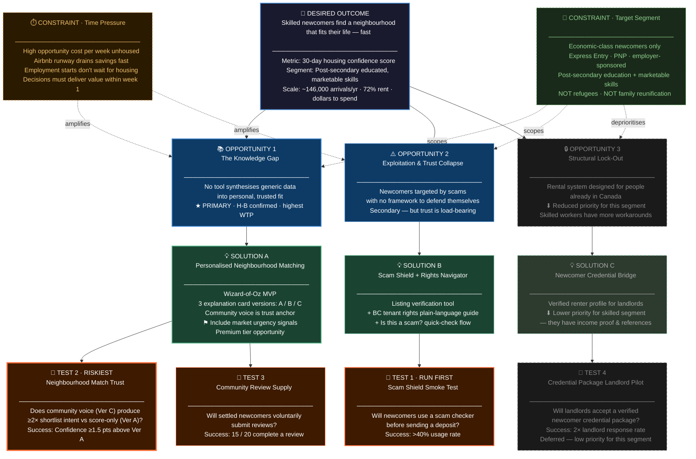

# Opportunity Solution Tree
**Connect4 · Newcomer Housing · Vancouver**
Version 2.2 — Added target segment constraint; reprioritised opportunities accordingly
Date: 2026-03-11

---

## Visual Overview

> **Reading the tree:** Two constraints (amber = time pressure, green = target segment) shape the opportunity layer. Opportunity 3 and Solution C are greyed out — reduced priority for the skilled-worker segment. Test 2 (heavier border) is the riskiest assumption and the MVP's primary experiment.

---

## Constraints

### Constraint 1 — Time Pressure
> Every solution must deliver value within the first week of search.

- 72% of BC newcomers stay in temporary accommodation on arrival (AWISA 2024)
- Vancouver median rent ~$2,570/month — every week without a lease is a material financial event
- For skilled workers, opportunity cost is compounded: employment start dates don't wait for housing decisions
- Market urgency signals (vacancy rates, rent trends by submarket) should be bundled into Solution A explanation cards — not built as a standalone product

### Constraint 2 — Target Segment
> Economic-class newcomers with post-secondary education and marketable skills. Not refugees. Not family reunification.

**Who this is:**
- Express Entry (Federal Skilled Worker, Canadian Experience Class), Provincial Nominee Programme, employer-sponsored
- Post-secondary educated, arriving with a job offer or high-confidence employment prospects
- Has disposable income — willing to pay for quality information and tools
- High opportunity cost per week: their time has a dollar value, decisions have career consequences
- Not dependent on settlement agencies or government support systems

**What this changes about the OST:**

| Area | Impact |
|---|---|
| Opportunity 1 — Knowledge Gap | Elevated. Lifestyle fit matters more when you're building a professional life, not just surviving. Willingness to pay (WTP) is higher. |
| Opportunity 2 — Exploitation & Trust Collapse | Maintained. Scams target skilled newcomers too — phantom listings don't discriminate by education level. |
| Opportunity 3 — Structural Lock-Out | Reduced. Skilled workers typically have foreign income proof, employer references, and savings for upfront rent. Credential barriers exist but are less acute. |
| Monetisation | Unlocked. This segment will pay for a premium matching product. Refugee/family-reunification segments require subsidised or free access — economic-class newcomers do not. |
| Community voice sourcing | Sharpened. Community reviews must come from settled newcomers in the same economic class — professional lifestyle context, not survival context. |

---

## Desired Outcome

> Skilled newcomers to Vancouver find a neighbourhood that genuinely fits their professional and personal life — not just the first available listing under their budget.

**Metric (primary):** 30-day housing confidence score (self-reported at 30 days post-lease).
**Metric (secondary):** Average days from arrival to signed lease.
**North Star:** "The tool finds your place. The platform helps you belong to it."
**Scale:** ~146,000 economic-class arrivals in Vancouver annually; 72% rent on arrival. This segment has disposable income and acute time pressure — addressable market has both size and willingness to pay (AWISA 2024).

---

## Competitive Landscape

No direct competitor exists for this product. The gap is confirmed by market research:

| Competitor | What they solve | Why it's insufficient |
|---|---|---|
| PadMapper / Zumper / Kijiji | Listing discovery | No newcomer context, no fit logic, high scam density |
| Rentals for Newcomers | Newcomer-friendly landlord directory | Small inventory, no personalisation, manual verification only |
| Arrive (RBC) / PrepareForCanada | Pre-arrival orientation content | Static editorial, generic city guides, no interactive tooling |
| MOSAIC / ISSofBC / settlement agencies | Holistic human support | Human capacity constrained, reactive not proactive, losing 48% of funding |
| Niche.com (US) | Neighbourhood scoring + reviews | US only, general population, no newcomer context, no Canadian data |
| Homeis | Diaspora social network | Country-of-origin community, not neighbourhood fit; not decision-support tooling |

**The gap Connect4 owns:** Personalised neighbourhood matching + community voice, for the pre-commitment decision stage, for economic-class newcomers. No product anywhere in the Canadian market addresses this. Niche.com is the nearest global analogue — not newcomer-specific, no Canadian data, no community voice layer.

---

## Opportunities

---

### Opportunity 1 — The Knowledge Gap *(Primary opportunity — highest signal + highest WTP)*
**Skilled newcomers cannot make confident neighbourhood decisions because no tool synthesises generic data into personal, trusted fit for someone at their life stage.**

**Why this segment amplifies the opportunity:**
A skilled worker arriving in Vancouver is not choosing between "safe enough" and "unsafe." They are choosing between Kitsilano and Mount Pleasant, between a 20-minute commute and a 35-minute commute, between a neighbourhood with a running community and one without. The decision is higher-resolution and higher-stakes — a poor fit delays professional integration, not just personal comfort.

**Evidence:**
- People explicitly ask communities "which areas are safe for someone like me" — not which areas are cheapest (Social listening)
- One person shared Airbnb screenshots in a Facebook group to crowd-source a safety assessment (Social listening)
- People want to know if a neighbourhood "matches their vibe" — not just transit scores (Built AI analysis)
- No Canadian equivalent of Niche.com; forums answer the same questions repeatedly with no resolution (Content Discovery)
- Homescoute (Vancouver, Jul 2025) is listing-first and city-only — the qualitative-fit gap remains open (Content Discovery)
- **Chris (interview):** Had "lots of data" but chose Dunbar — wrong for his lifestyle. Regretted it within days. Delayed his ability to settle into Vancouver life at all.
- **Reza (interview):** Wanted a tool that could fuse "feeling and facts" and confirm "it was right for me." Trusted only Iranian Telegram community voices.

**Cluster Insight:** The gap is not information availability — it is personalised synthesis. The harder problem is emotional resonance and trusted fit, not data quality. For skilled workers with high opportunity cost, a wrong neighbourhood decision has a measurable professional cost.

**Interview resolution:** H-A (info gap) vs H-B (trust gap) resolved in favour of **H-B**. Both participants had sufficient information and still made decisions they regretted.

---

### Opportunity 2 — Exploitation & Trust Collapse *(Secondary — trust is load-bearing for all segments)*
**Newcomers are specifically targeted by rental scams and predatory practices, and have no scalable framework to defend themselves.**

**Why it remains relevant for this segment:**
Skilled workers have more resources but are not immune to phantom listings, illegal deposit demands, or bait-and-switch tactics. The emotional cost — anxiety, time lost, decision paralysis — is the same regardless of income. And scam exposure directly feeds time pressure (Constraint 1): every fake listing viewed is runway burned.

**Evidence:**
- Phantom listings are the most common scam — fake ads luring renters to pay deposits upfront (IC.nrp)
- Rental scams specifically target newcomers and international students in Vancouver, Toronto, and Calgary (Rentals for Newcomers)
- Renters paid 22% higher rent just to access verified listings — scam risk is a real financial tax (Globe)
- Most newcomers stay silent about bad landlord behaviour (New Canadian Media)
- 48% of GTA newcomer agencies expect program closures due to $317.3M federal budget reduction (United Way GTA, Feb 2025)
- **Reza (interview):** Scam and "unavailable" listings wasted critical time, raised anxiety, forced standard-lowering mid-search.

**Cluster Insight:** Trust is load-bearing. If newcomers can't trust the rental environment, Solution A cannot be effective — a confident neighbourhood match is worthless if the listings in that neighbourhood can't be trusted.

---

### Opportunity 3 — Structural Lock-Out *(Reduced priority for this segment)*
**The rental system is structurally designed for people who already live in Canada.**

**Why it's deprioritised for skilled workers:**
Economic-class newcomers typically arrive with a foreign employment offer or track record, savings sufficient for several months' upfront rent, and education credentials that translate more readily than refugee documentation. They face the credential problem, but less acutely than other newcomer classes. Both interview participants (resourceful, educated) bypassed the problem rather than confronting it — via community networks and Airbnb.

This opportunity remains real and important for other newcomer segments. It is not Connect4's v1 focus.

**Revisit condition:** If targeted interviews with skilled workers who faced direct landlord rejection (n=5+) show this is blocking even this segment, reprioritise before Test 4.

---

## Solutions

---

### Solution A — Personalised Neighbourhood Matching *(Primary solution)*
**Addresses: Opportunity 1**

A neighbourhood matching tool that synthesises lived-experience data (safety perception, walkability, transit, vibe, cultural context) against the user's specific profile — commute mode, daily rhythm, fitness habits, cultural community proximity, safety sensitivity, and social preferences. Returns a ranked shortlist of 3–5 Vancouver neighbourhoods with plain-language explanation cards.

**Segment fit:** High. Skilled workers care about neighbourhood quality of life, professional community proximity, and lifestyle match — not just price. This is the highest-WTP use case.

**Monetisation signal:** This segment will pay for a premium matching product. Pricing hypothesis: $29–49 CAD one-time, or freemium with a paid "deep match" tier.

**MVP approach:** Wizard-of-Oz — human-curated matches, no AI infrastructure. Three explanation card versions:
- Version A: recommendation + match score only
- Version B: A + data rationale (sources cited for every claim)
- Version C: B + community voice excerpt from a settled newcomer with a matching lifestyle profile and similar professional context

**Respects time constraint:** Market urgency signals (current vacancy rates, rent trends by submarket) bundled directly into explanation cards.

**Interview signal:** Highest demand. Both Reza and Chris stated they would have used this. AI trust condition: must show reasoning, must be grounded in lived experience not statistics.

**Matching algorithm — two variants:**
- **Variant 1 (Weighted Scoring):** Quiz answers adjust attribute weights against hand-crafted neighbourhood scores. Deterministic, no external dependencies, suited to A/B testing. Current prototype approach. See [Concept_Brief_Opportunity1.md](Concept_Brief_Opportunity1.md).
- **Variant 2 (Semantic):** Neighbourhood descriptions embedded as vectors; quiz output (including open-ended text) converted to a query; LLM returns ranked recommendations with plain-language rationale grounded in source text. Post-MVP — triggered when open-ended quiz fields are added or Variant 1 shows poor discrimination. See [Concept_Brief_SemanticMatching.md](Concept_Brief_SemanticMatching.md).

---

### Solution B — Scam Shield + Rights Navigator *(Secondary solution — trust foundation)*
**Addresses: Opportunity 2**

A listing verification tool that flags phantom listings and suspicious landlord patterns, combined with a plain-language guide to BC tenant rights. Includes an "Is this a scam?" quick-check flow.

**Segment fit:** Medium-high. Skilled workers have more resources to absorb financial scam losses, but time lost to fake listings has high opportunity cost. Trust foundation must be in place before Solution A can be effective.

**Test priority:** Test first because trust is load-bearing.

**Interview signal:** Confirmed need. Reza's scam encounters wasted critical time and forced standard-lowering mid-search.

---

### Solution C — Newcomer Credential Bridge *(Deferred — lower priority for this segment)*
**Addresses: Opportunity 3**

A verified renter profile that translates international credentials for Canadian landlords — foreign employer verification, reference letters in Canadian format, and a legally compliant upfront payment escrow option.

**Segment fit:** Low for v1 target. Skilled workers typically have income proof, employer references, and upfront rent savings. This solution addresses a real problem for other newcomer classes — consider as a future segment expansion, not MVP scope.

---

## Assumption Tests

---

### Test 1 — Scam Shield Smoke Test *(Run first)*
**Tests:** Solution B
**Assumption:** Skilled newcomers will use a scam-checking tool before sending a deposit, even under time pressure.
**Method:** Lightweight "paste a listing URL" scam checker landing page. Drive traffic via LinkedIn newcomer groups, Facebook professional newcomer communities, and employer onboarding partners. Measure usage rate.
**Success signal:** >40% of visitors run a check before proceeding.
**Kill signal:** <15% usage rate → pivot framing; consider bundling scam check into Solution A listing flow rather than standalone.

---

### Test 2 — Neighbourhood Match Explanation Trust *(Riskiest assumption)*
**Tests:** Solution A
**Assumption:** Skilled newcomers trust and act on neighbourhood recommendations only when the explanation includes community voice from newcomers with a similar professional profile (Version C > Version B > Version A).
**Method:** 8–10 moderated interviews with recent economic-class newcomers (arrived <12 months, post-secondary educated, employed or actively job-seeking). Show Wizard-of-Oz recommendation cards — one group per version. Measure shortlist intent and confidence score.
**Success signal:** Version C produces ≥2× shortlist intent vs. Version A; confidence score ≥1.5 pts above Version A.
**Partial signal:** Version B outperforms A but C does not significantly outperform B → data transparency is the trust driver. Deprioritise community review supply chain; invest in data quality.
**Kill signal:** No meaningful difference across A, B, C → pivot to human-curated community guide without AI matching.

---

### Test 3 — Community Review Supply
**Tests:** Solution A — community voice layer (prerequisite for Version C)
**Assumption:** Settled economic-class newcomers will voluntarily submit reviews if the contribution feels low-effort and purposeful.
**Method:** Recruit 20 settled newcomers (3–18 months in Vancouver, post-secondary educated). Present the review submission flow. Measure completion rate.
**Success signal:** 15/20 complete a review; trustworthiness score for cards with reviews ≥1.5 pts above cards without.
**Note:** Reviews must be tagged by professional context (e.g. "software engineer, downtown commute, no car") — generic newcomer reviews will not satisfy the trust condition for this segment.

---

### Test 4 — Credential Package Landlord Pilot *(Deferred)*
**Tests:** Solution C
**Assumption:** Landlords will accept a verified newcomer credential package in lieu of a Canadian credit score.
**Dependencies:** Revisit only if targeted interviews with skilled workers show credential rejection is blocking even this segment. Do not run before Test 3.

---

## Research Gaps

| Gap | Required action |
|---|---|
| Both n=2 interviews were relatively resourceful newcomers — consistent with target segment but sample too small | Recruit 6–8 more economic-class newcomers (Express Entry / PNP / employer-sponsored) |
| No willingness-to-pay data collected | Add WTP question to Test 2 interview protocol: "What would you pay for a tool that had given you this result before you arrived?" |
| Community review segment fit unvalidated | Confirm in Test 3 that professional-context tags on reviews meaningfully increase trust vs. generic newcomer reviews |
| Opportunity 3 (Structural Lock-Out) untested for skilled workers | 3–5 targeted interviews before deciding whether to build or permanently deprioritise Solution C |

---

## Priority Order Summary

| Priority | Opportunity | Solution | Test |
|---|---|---|---|
| 1 | Opportunity 2 — Exploitation & Trust Collapse | Solution B — Scam Shield | Test 1 |
| 2 | Opportunity 1 — The Knowledge Gap | Solution A — Neighbourhood Matching | Test 2 |
| 3 | Opportunity 1 — supply side | Solution A — Community Voice layer | Test 3 |
| 4 | Opportunity 3 — Structural Lock-Out | Solution C — Credential Bridge | Test 4 (deferred) |
| Not an opportunity | Time Pressure | Bundle urgency signals into Solution A | — |
| Out of scope v1 | Refugees · Family reunification | Separate product / partnership track | — |

---

*Sources: Miro problem-space board (junior PM review, Mar 2026) · Primary interviews: Reza (Q1–Q12), Chris (Q1–Q12) · Competitive landscape research (Mar 2026) · Problem Definition Doc · AWISA 2024 · United Way GTA Feb 2025 · Hypothesis files H-A, H-B*
